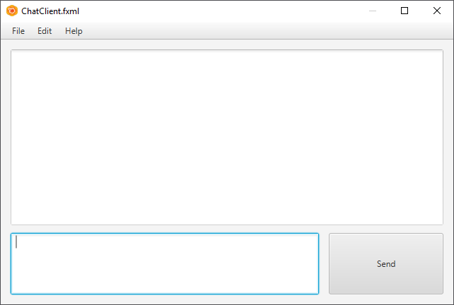
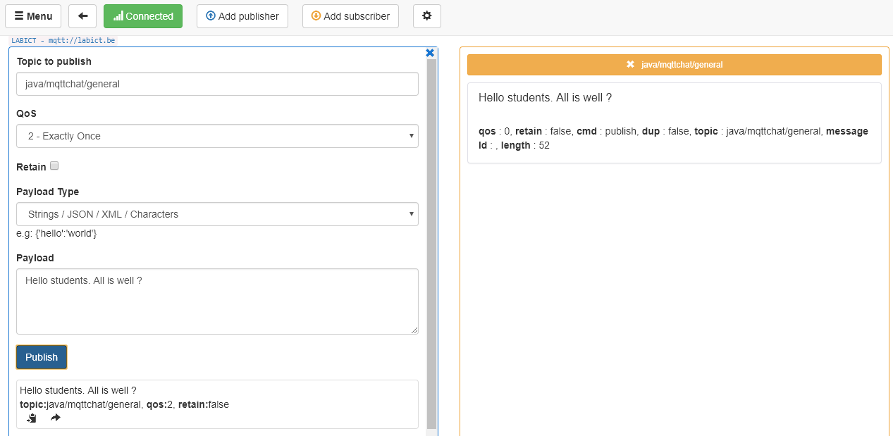

# Assignment - MQTT Chat

In this assignment we will create a small but extendible MQTT Chat Application.

You will find two NetBeans projects in the assignment repository:
* **JavaMqttChatService**: A wrapper class around the Paho MQTT Libraries that allow you to easily send strings to an MQTT server.
* **FxmlMqttChatClient**: An start application that contains a simple GUI and some pre-written code for you to start from. Is also references the *JavaMqttChatService* as a dependency.

## Testing the Setup

Before you start tinkering with the code, first try the application as is. Do this by importing both projects into NetBeans and by running the *FxmlMqttChatClient* application. You should get the basic GUI shown below:

It is not very user friendly. However if you type something in the bottom `TextArea` and hit the Send `Button`, it will send a message to the MQTT broker. Can you identify the message that is send? Is it text you typed?

You will also see that you receive your own messages. That is normal since the client is publishing to the same channel as it is subscribed.

Wish to test some more? Than you can use the MQTTBox application to publish and subscribe to the channel `java/mqttchat/general` on the `labict.be` server:

## The MqttChatService class

All interaction with the MQTT server is done via the `MqttChatService` class. It has the following interface:

Two constructors are available. A default one that joins the `general` chat channel or a parameterized constructor that requires a `clientId` which is nothing but a unique identifier and a `channelName` that can be used to create private or grouped channels.

The second most important method is the `sendMessage()` method which can send a `String` on the channel that was provided via the constructor. This allows you to send data to all clients that are subscribed to the same channel.

The `disconnect()` method should be called when the application is closed.

## The Assignment

This assignment is spread over several labs and you will be able to work on it for several weeks. It is strongly encouraged to be creative and add your own ideas to it. Maybe work together with others to create a more versatile chat client (work together - not copy paste !).

Basic requirements:
1. Fix the chat client so it can receive and send messages via the GUI
2. Create a nicer GUI
3. Allow the user to choose a nickname
4. Allow the user to input a chat channel

Extra ideas:
1. Send JSON instead of a simple String (allows other info to be added to a chat message (time, nickname, ...))
2. Add colored text in the chat history
3. Show a list of people inside the chat channel

If required, you may extend the `MqttChatService` application as required. You should however keep it backward-compatible so it will still work with older versions.

Make sure to fill in the [report.md](report.md) file. No report, no grades.

Make sure that the application compiles and runs without crashing.
